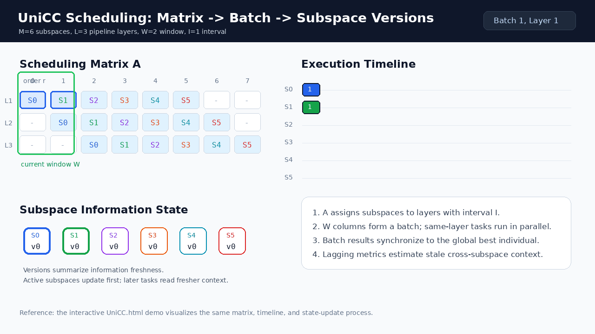

# UniCC

[中文说明](README_CN.md) | English

UniCC is a unified cooperative coevolutionary architecture for large-scale global optimization (LSGO). The repository contains a reusable UniCC framework, CEC2013 LSGO benchmark code, baseline optimizers, and an example experiment that runs UniCC on the benchmark.



For an interactive explanation of the scheduling matrix, pipeline execution, speedup, and information lag, open [UniCC.html](UniCC.html). The same visualization is also available in the previous anonymous demo: <https://anonymous.4open.science/w/UniCC-E7EF/UniCC.html>.

## What UniCC Does

UniCC decomposes a high-dimensional optimization problem into subspaces and schedules subspace optimizers through a pipeline.

- `M`: number of subspaces.
- `I`: interval between adjacent pipeline layers in the scheduling matrix.
- `L`: number of pipeline layers.
- `W`: window size, i.e. how many scheduling columns are processed in one batch.
- `A`: scheduling matrix that maps subspaces to pipeline layers and execution order.
- `lag_total` and `mean_lagging_subspaces`: metrics that estimate how stale cross-subspace information is during scheduling.

The framework in [UniCC.py](UniCC.py) is intentionally independent of a specific benchmark or experiment. Experiments provide the objective function, optimizer class, decomposition, boundaries, random seeds, and output logic.

## Repository Layout

```text
.
├── UniCC.py                     # Reusable UniCC framework
├── UniCC.html                   # Interactive architecture visualization
├── utils.py                     # Objective wrapper, grouping, recording, and plotting helpers
├── experiment/
│   └── cec2013lsgo.py           # Example CEC2013 LSGO experiment using UniCC
├── benchmark/cec2013lsgo/       # CEC2013 LSGO benchmark implementation and data files
├── baseline/                    # Baseline optimizers
├── paper/                       # Paper draft/review PDF
└── assets/
    └── unicc_framework.gif      # README animation
```

`save_dir/` is ignored by Git. Experiment outputs are written there by default but are not synchronized to the repository.

## Installation

Use Python 3.9 or newer. A virtual environment is recommended.

```bash
git clone git@github.com:Wukong-SCUT/UniCC.git
cd UniCC

python -m venv .venv
source .venv/bin/activate
pip install numpy scipy matplotlib numba
```

## Run the CEC2013 LSGO Example

```bash
python experiment/cec2013lsgo.py
```

By default, the script runs the configured UniCC parameter sweep in `main()` and writes records to:

```text
save_dir/unicc/cec2013lsgo/budget3000000/question{fun_id}/I{interval}_L{pipeline_layers}_W{window_size}/
```

Each output directory contains:

- `evaluation_record.txt`: best fitness records at selected function evaluation budgets.
- `schedule_params.txt`: UniCC scheduling parameters and lagging metrics.

To change the experiment, edit the loop in `experiment/cec2013lsgo.py`:

```python
for fun_id in range(4, 5):
    for interval in range(5, 6):
        for pipeline_layers in range(1, 5):
            for window_size in range(1, 6):
                ...
```

## Use UniCC in Your Own Experiment

The framework only requires four pieces from your experiment: a full-space objective, an optimizer class, a subspace decomposition, and variable boundaries.

```python
import numpy as np

from UniCC import UniCC
from baseline.CMAES.cmaes import CMAES


def objective(x_batch):
    return np.sum(x_batch ** 2, axis=1)


dimension = 100
grouping_result = [group.tolist() for group in np.array_split(np.arange(dimension), 10)]

unicc = UniCC(
    objective=objective,
    optimizer_cls=CMAES,
    grouping_result=grouping_result,
    lower_boundary=-100,
    upper_boundary=100,
    max_fes=100000,
    interval=1,
    pipeline_layers=2,
    window_size=3,
    optimizer_options={
        "sigma": 0.5,
        "is_restart": False,
    },
)

result = unicc.run(
    initial_best_individual=np.zeros(dimension),
    cycle_num=1,
    seed=42,
)

print(result.fitness_records)
print(result.time_records)
print(result.best_individuals[0])
```

## API Notes

`UniCC` expects the optimizer class to follow this interface:

```python
optimizer = optimizer_cls(problem, options)
result = optimizer.optimize()
```

`problem` contains:

- `fitness_function`: wrapped subspace objective.
- `ndim_problem`: subspace dimension.
- `lower_boundary`: subspace lower bound.
- `upper_boundary`: subspace upper bound.

`result` must contain one of `best_so_far_x`, `best_x`, or `x`.

If the objective cannot be pickled for multiprocessing, pass `objective=None` and provide an `objective_factory` instead. See `CEC2013ObjectiveFactory` in [experiment/cec2013lsgo.py](experiment/cec2013lsgo.py).

## Main Results Returned by UniCC

`unicc.run(...)` returns a `UniCCResult` object:

- `fitness_records`: best fitness history for each independent cycle.
- `time_records`: runtime of each cycle.
- `best_individuals`: final best full-space individual of each cycle.

Useful scheduling properties:

```python
unicc.schedule_matrix
unicc.lag_total
unicc.mean_lagging_subspaces
```

## Notes

- `UniCC.py` contains the reusable framework.
- `experiment/cec2013lsgo.py` is an example experiment built on top of the framework.
- Generated records under `save_dir/` are intentionally ignored by Git.
- The bundled CEC2013 LSGO data files are required for the provided benchmark experiment.
